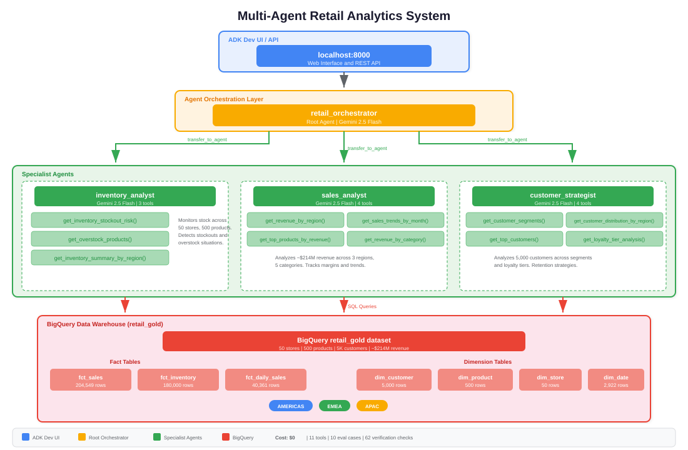
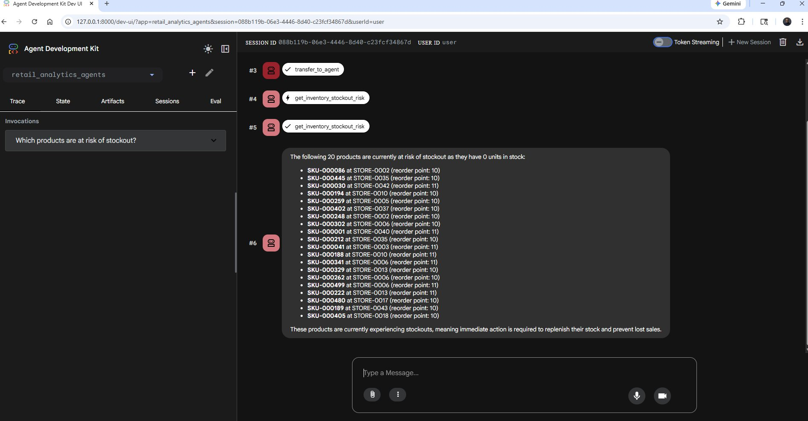
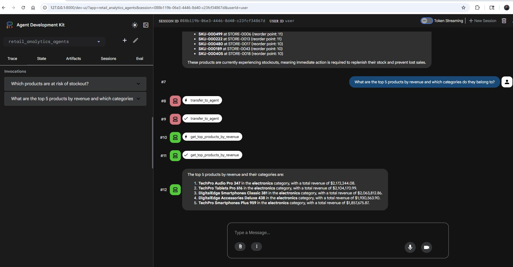
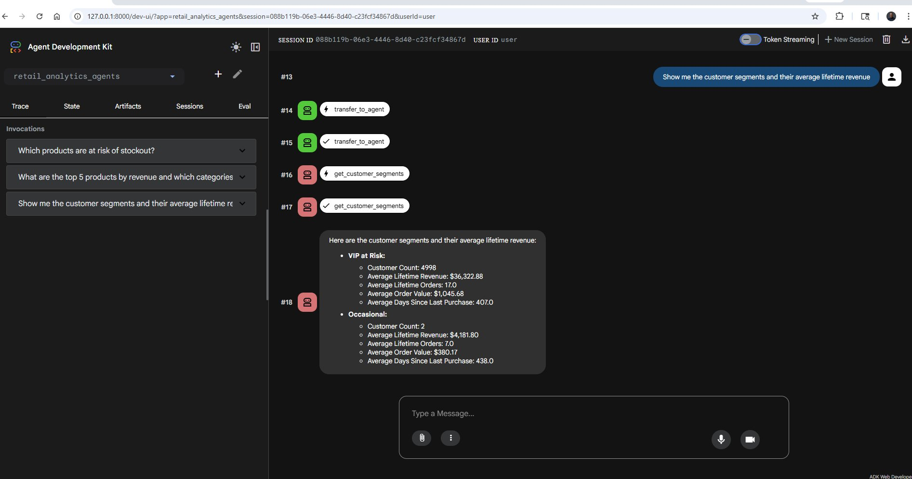
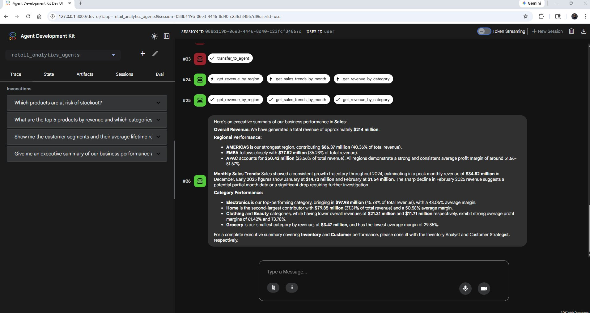
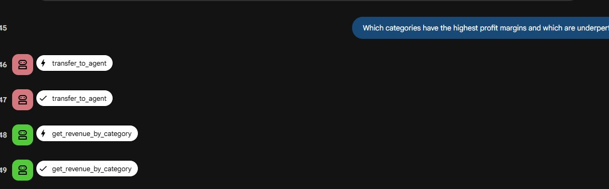
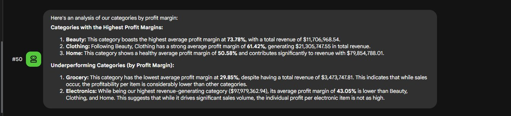

# Multi-Agent Retail Analytics System

A multi-agent AI system built with Google Agent Development Kit (ADK) that provides real-time retail analytics by querying a BigQuery star schema. Three specialist agents (Inventory, Sales, and Customer) are orchestrated by a root agent that routes natural language questions to the right domain expert.

---

## Architecture

The system uses a hierarchical multi-agent pattern. The root orchestrator receives user queries, determines the appropriate domain, and delegates to one or more specialist agents. Each specialist has access to purpose-built BigQuery tools that execute optimized SQL against the gold layer star schema.



---

## Key Features

- Intelligent routing: Root orchestrator analyzes queries and delegates to the correct specialist agent
- Multi-agent coordination: Cross-functional queries engage multiple agents in parallel
- Live BigQuery queries: 11 tools execute real SQL against a star schema with 390K+ rows
- ADK Dev UI: Interactive web interface at localhost:8000 for testing and debugging
- Evaluation suite: 10-case evalset with tool trajectory and response matching
- Zero cost: Runs entirely on GCP free tier + Gemini free tier

---

## Tech Stack

| Component | Technology |
|-----------|-----------|
| Agent Framework | Google ADK 1.25.1 |
| LLM | Gemini 2.5 Flash (free tier via AI Studio) |
| Data Warehouse | BigQuery (star schema from Enterprise Analytics project) |
| Infrastructure | Terraform-managed GCP (IaC project) |
| Language | Python 3.14 |
| Auth | gcloud application-default credentials |

---

## Prerequisites

- Python 3.10+
- Google Cloud SDK (gcloud)
- GCP project with star schema deployed ([enterprise-analytics](https://github.com/gbhorne/enterprise-analytics))
- Gemini API key from [AI Studio](https://aistudio.google.com/apikey) (free, no credit card required)

---

## Quick Start

```bash
git clone https://github.com/gbhorne/adk-retail-agents.git
cd adk-retail-agents

# Create and activate virtual environment
py -m venv .venv
.venv\Scripts\Activate.ps1

# Install dependencies
pip install google-adk google-cloud-bigquery

# Add your Gemini API key
echo "GOOGLE_API_KEY=your-key-here" > retail_analytics_agents/.env

# Launch the ADK Dev UI
adk web .
```

Open http://localhost:8000 and start querying.

---

## Example Queries

| Query | Agent(s) Invoked | Tools Called |
|-------|------------------|-------------|
| Which products are at risk of stockout? | inventory_analyst | get_inventory_stockout_risk |
| What are the top 5 products by revenue? | sales_analyst | get_top_products_by_revenue |
| Show me customer segments and spending | customer_strategist | get_customer_segments |
| Break down revenue by category | sales_analyst | get_revenue_by_category |
| Compare AMERICAS vs EMEA performance | sales_analyst + inventory_analyst | Multiple tools in parallel |
| Executive summary of our business | All 3 agents | 6+ tools coordinated |

---

## Agent Details

### Inventory Analyst

Monitors stock health across 50 stores and 500 products. Identifies stockouts, overstock situations, and regional imbalances.

Tools: `get_inventory_stockout_risk(threshold)`, `get_overstock_products(multiplier)`, `get_inventory_summary_by_region()`

### Sales Analyst

Analyzes approximately $214M in revenue across regions, categories, and time periods. Tracks profitability and margin trends.

Tools: `get_revenue_by_region()`, `get_top_products_by_revenue(top_n)`, `get_sales_trends_by_month()`, `get_revenue_by_category()`

### Customer Strategist

Analyzes 5,000 customers across segments and loyalty tiers. Identifies high-value patterns and retention opportunities.

Tools: `get_customer_segments()`, `get_top_customers(top_n)`, `get_customer_distribution_by_region()`, `get_loyalty_tier_analysis()`

---

## Screenshots

### Inventory Agent: Stockout Risk Detection

Agent identifies 20 products at 0 stock with reorder points and recommends immediate replenishment.

### Sales Agent: Top Products by Revenue

Top 5 products all in Electronics. TechPro Audio Pro 347 leads at $2.17M revenue.

### Customer Agent: Segment Analysis

Two segments identified: VIP at Risk (4,998 customers, $36K avg lifetime) and Occasional (2 customers).

### Executive Summary: Multi-Agent Parallel Execution

Orchestrator engages Sales Analyst, which fires 3 tools in parallel (revenue by region, monthly trends, category breakdown). Produces full $214M business summary.

### Category Margin Analysis: Routing and Response


Query routed to sales_analyst, calls get_revenue_by_category. Beauty leads at 73.78% margin, Electronics at 43.05%.

---

## Evaluation

Run the 10-case eval suite:

```bash
adk eval --config_file_path retail_analytics_agents/test_config.json \
  retail_analytics_agents \
  retail_analytics_agents/retail_analytics_eval.evalset.json \
  --print_detailed_results
```

Eval coverage: 3 inventory routing and tool tests, 4 sales routing and tool tests, 3 customer routing and tool tests. Tool trajectory threshold: 0.6. Response match threshold: 0.4.

---

## Repository Structure

```
adk-retail-agents/
    retail_analytics_agents/
        __init__.py
        agent.py                                 # Root agent + 3 sub-agents
        tools.py                                 # 11 BigQuery tool functions
        retail_analytics_eval.evalset.json       # 10 eval test cases
        test_config.json                         # Eval criteria thresholds
    docs/
        ARCHITECTURE.md                          # Architecture decision records
        BUILD_GUIDE.md                           # Full build walkthrough
        QA_GUIDE.md                              # Q&A reference
        architecture_diagram.svg
        screenshots/
    README.md
    requirements.txt
    LICENSE
```

---

## Cost

$0 total. Runs entirely on GCP free tier (BigQuery) and Gemini free tier (15 RPM, 1,500 requests per day).

---

## Related Projects

- [Enterprise Analytics Platform](https://github.com/gbhorne/enterprise-analytics) - The BigQuery star schema this system queries
- [Terraform IaC](https://github.com/gbhorne/terraform-gcp-analytics) - Infrastructure that provisions the data warehouse

---

## Disclaimer

Built as a portfolio project for educational and demonstration purposes. Not intended for production use without further hardening, security review, and compliance validation.

---

## Author

**Gregory B. Horne**

[GitHub: gbhorne](https://github.com/gbhorne) | [LinkedIn](https://linkedin.com/in/gbhorne)

---

## License

MIT
